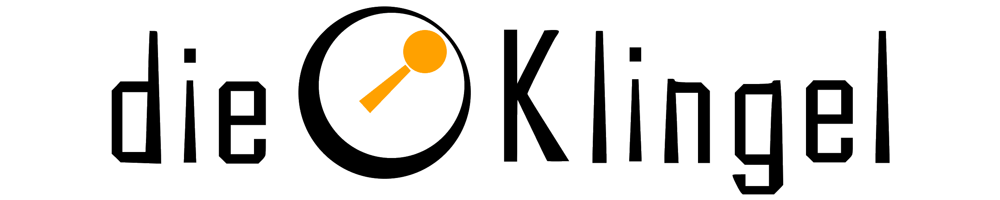

# 🔔 dieKlingel-com



Welcome to the source code of the <dieklingel.com> site. This site is build
using [Vue.js](https://vuejs.org) and [Nuxt](https://nuxt.com). You can find relevant information or the current state of the project on the website.

## 🪜 Dependencies

- [Yarn](https://yarnpkg.com/)
- [Node](https://nodejs.org/)

## 🏗️ Run the site local

```sh
yarn install
yarn dev
```

## 🪄 Run the linter

```sh
yarn lint
```

## 📦 Build the static site

```sh
yarn generate 
```
